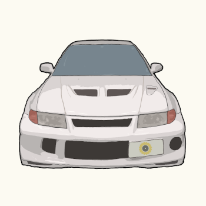

**sAbIz**

*Software Engineer@Tokyo,Japan*

  <a href="https://twitter.com/t0mu_twit" class="icon-contact">
    <i class="fab fa-twitter fa-2x"></i>
  </a>
  <a href="https://github.com/sabiz" class="icon-contact">
    <i class="fab fa-github fa-2x"></i>
  </a>
  <a href="mailto:bellett@sabiz.jp" class="icon-contact">
    <i class="fas fa-envelope fa-2x"></i>
  </a>

## Skill
<!-- icon sample https://simpleicons.org/ -->

  

  

  

## Career

### 2013〜2018
- Android system app
- iOS app
- Hybrid app (Cordova)

### 2018~
- Image Recognition (Deep learning & Image processing)
- Data science (Machine learning)

